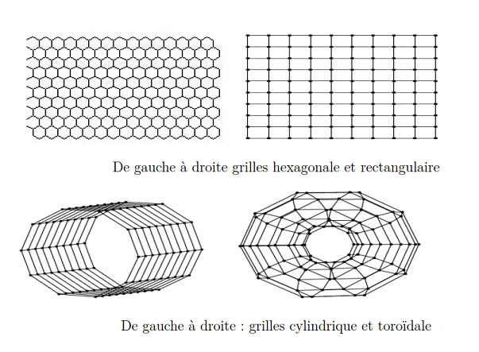
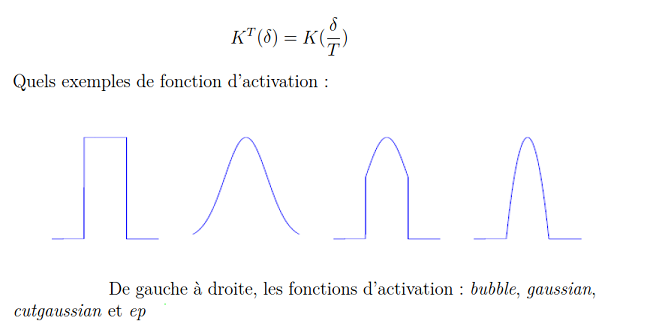
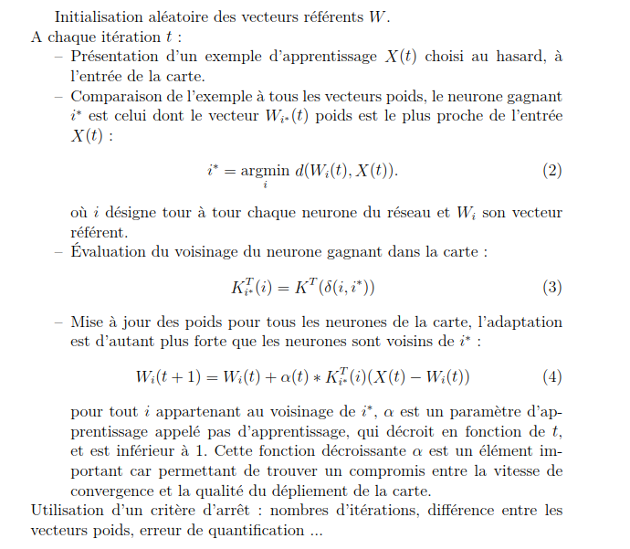
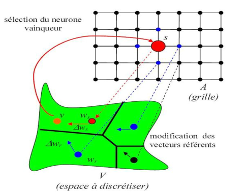
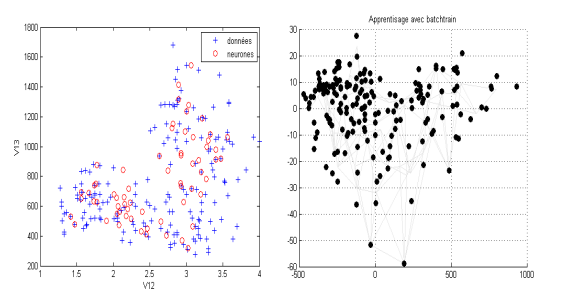
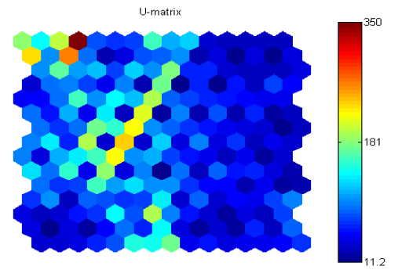
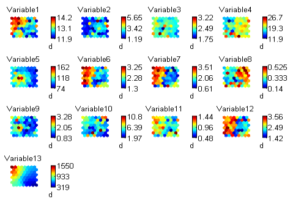
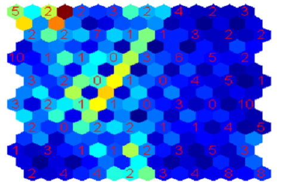
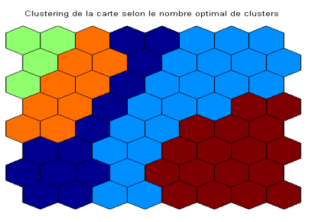

# Classification automatique et Cartes topologiques de Kohonen

## Utilisation des méthodes neuronales comme outil d’analyse de données

Apparues dans les années 80, les méthodes neuronales provenant de travaux pluridisciplinaires, ont avec leur développement suscité l’intérêt des mathématiciens et notamment des statisticiens. Les réseaux de neurones sont composés d’éléments simples (ou neurones formels et artificiels). Leurs fonctionnements sont fortement influencés par la connexion des éléments entre
eux. Les réseaux de neurones sont souvent utilisés pour analyser des données observées dont on cherche à comprendre la structure. La conception d’un réseau de neurones suit chronologiquement quatre étapes :

* **Préparation des données** : cette étape qui coïncide avec le début du processus d’élaboration d’un réseau neuronal est d’une importance capitale. Ainsi il faut choisir les échantillons dont leur nature imposera le type de réseau à utiliser, le nombre de neurones, la façon dont il faudra mener l’apprentissage. Les tests et la validation reposent également sur le choix de l’échantillon.

* **Choix du modèle du réseau** : le concepteur du réseau choisit la structure de son réseau qui dépend la nature des échantillons parmi plusieurs modèles neuronaux dont les plus connus restent sans conteste le modèle du Perceptron Multicouches pour les apprentissages supervisées et le réseau de Kohonen que l’on étudiera de manière plus détaillée dans le suite de ce rapport, pour les apprentissages non supervisées.    

* **Phase d’apprentissage** : pendant cette étape, l’algorithme d’apprentissage est répété de manière itérative jusqu’à ce que l’optimisation d’un critère a été obtenue. Cependant l’apprentissage peut se faire deux manières différentes : l’apprentissage « par paquet » (batch training) consiste à ajuster les paramètres internes en présentant les vecteurs d’entrée/sortie de tout le jeu de données et l’apprentissage « pas à pas ou séquentiel » (incremental training) consiste à ajuster les paramètres en présentant les composantes du vecteur d’entrée/-sortie les unes après les autres.L’apprentissage par paquet est utilisé pour simuler un réseau statique (pas de connexion arrières) : l’ordre selon lequel on peut lui présenter les données en entrée n’est pas important et n’a pas d’influence sur l’évolution de ses poids au cours de l’apprentissage. Par contre, pour un processus qui dépend du temps, il est préférable d’utiliser un apprentissage séquentiel. Ce type d’apprentissage utilise un réseau de neurones contenant des connections arrières. L’ordre de présentation du jeu de données au réseau de neurone sera alors primordial.

* **Validation** : La dernière consiste une fois que le réseau appris, effectuer des tests pour vérifier que le réseau réagit bien qu’on lui présente des données inconnues. Une manière très simple pour valider un réseau est d’utiliser la technique du Early stopping. Elle consiste à diviser les données disponibles en trois lots distincts. Le premier lot sert à entraîner le réseau de neurone. Le second lot sert à la validation du réseau : dès que le réseau est optimal sur cette base de validation l’apprentissage est stoppé même si le réseau aurait pu encore s’améliorer sur la base d’apprentissage, d’où le nom d’early stopping. Cette méthode vise à éviter le sur-apprentissage du réseau, d’éviter que celui ci se spécialise sur les réalisations du bruits dans la base d’apprentissage. Le troisième lot sert à vérifier que la généralisation est correcte. Cependant il existe d’autres méthodes pour faire la validation comme cross validation, le bootstrapping... Ainsi en analyse des données, les méthodes non supervisées sont les plus utilisées et en particulier l’algorithme de Kohonen. Il permet d’effectuer à la fois une projection et une classification des données.

## Cartes topologiques auto-organisatrices de Kohonen

Les cartes topologiques auto-organisatrices font partie de la famille des modèles à « apprentissage non supervisé ». Ce sont des méthodes de quantification vectorielle qui cherchent à partitionner l’ensemble des observations disponibles en groupements similaires par des algorithmes d’apprentissage. Ces groupements sont caractérisés par leurs structures de voisinage qui peuvent être matérialisées à l’aide d’un espace discret appelé « carte topologique ». Cet espace forme un treillis de faible dimension sur lequel les structures de voisinages sont prises en considération par le modèle. Le choix de la topologie dépend de la nature des problèmes. Les figures ci-dessous montrent quelques exemples de topologies tirés de la boite à outils somtoolbox.

La mise en œuvre d’une carte nécessite une distance `δ` sur l’espace topologique pour définir la notion de voisinage sur la carte. Les distances qui lient les neurones les uns des autres permettent de varier l’influence relative des différents neurones qui peut être quantifié par une fonction `K(δ)`. On utilise souvent la famille `K^T` fonction paramétrée par `T` appelée parfois fonctions d’activation pour mieux contrôler la taille du voisinage :

Les neurones possèdent des coordonnées fixes sur la cartes et coordonnées adaptatives dans l’espace d’entrées appelées vecteurs de poids ou vecteurs référents.    
Une fois la topologie de carte et les fonctions d’activation choisies, les vecteurs référents sont obtenus par apprentissage à partir des données. Nous allons maintenant présenter l’algorithme utilisé pour l’apprentissage de la carte.

Les étapes 2, 3 et 4 s’appellent respectivement :

* **Compétition** : Après sélection d’un exemple dans la banque de données on cherche le neurone qui lui ressemble le plus. Ce neurone dit « neurone gagnant » est souvent noté bmu (Best Matching Unit).

* **Coopération** : Dans cette étape, on détermine le voisinage du neurone gagnant. Il désigne la région de la carte la plus active et qui s’approche le mieux, au sens de la distance utilisée, de l’observation. La taille du voisinage du neurone gagnant est contrôlée par le rayon d’apprentissage.

* **Adaptation** : On modifie le neurone gagnant pour qu’il ressemble un plus à l’exemple puis on diffuse l’information sur son voisinage. Cette modification se fait à l’aide de la fonction d’activation qui permet de contrôler l’influence du neurone gagnant sur son voisinage.

## Exemple de cartes de Kohonen

Au cours de ce stage, nous avons travaillé avec le logiciel matlab et utilisé la boite à outils somtoolbox développée par l’équipe de Laboratory of Cumputer and Information Science of Helsinki University of Technology.
Pour comprendre comment fonctionne notre nouvel outil de travail, nous avons écrit un programme test sur des données réelles de petite taille. Cette étape va nous de permettre comprendre l’influence des différents paramètres du réseaux de neurones (le nombre de neurones, le rayon de voisinage, le nombre d’itérations, le pas d’apprentissage ...) sur les résultats auto-classification.
Les données étudiées sont issues d’analyses chimiques de plusieurs vins de la même région de l’Italie mais correspondant à trois cépages différents. Les analyses chimiques ont permis de mesurer les quantités de 13 constituants contenus dans chacun de ces 3 types de vins. Nous allons chercher à déterminer une classification de ces 178 vins avec les cartes de Kohonen.
L’ordre de grandeur de certaines variables est grand par rapport aux autres, donc on peut centrer et réduire les variables pour avoir un jeu de données homogènes.
Cette étape est suivie par le choix du nombre de neurones qui dépend de la taille du jeu de données. Si ce nombre n’est pas suffisant, les neurones seront obligés de capturer beaucoup d’informations de nature différente (il y’a beaucoup d’informations et peu de neurones pour les représenter). La classification qui s’en suit ne permettra pas d’obtenir des classes distinctes.
A l’inverse s’il y’a trop de neurones, certains neurones ne représentant aucune information rendent moins lisible la carte. La figure ci dessous permet de regarder si la carte se déplie bien sur les données : on a fait une analyse en composante principe (ACP) pour représenter de façon synthétique les données, les vecteurs référents sont liés par des lignes. On peut également
par exemple représenter la première variable en fonction de la deuxième pour les données et les référents.

Ces résultats ont été obtenus avec 50000 itérations et 64 neurones. Une fois la carte apprise, on peut utiliser quelques outils de visualisation pour
les premières interprétations tels que la carte des distances, la carte par dimension d’entrée...

La figure ci-dessus représente la carte des distances d’apprentissage. Elle montre les distances entre deux neurones sur la carte. Sur cette carte, chaque neurone(hexagone) est séparé de son voisin par un hexagone. Une couleur bleue des hexagones qui séparent les neurones indique que les distances entre ces derniers sont faibles et caractérise les zone homogène dans la carte (ensemble de neurones peu différents). Une couleur rouge indique une zone frontière.
La carte des poids par dimension d’entrée  permet de regarder comment chaque zone de la carte réagit par rapport à chaque variable. Ce qui sera très utile lorsque l’on interprétera les classes obtenues après classification.
Elle permet également d’étudier les corrélations entre les variables au sens de la carte des individus.

Les variables observées ici ne sont pas corrélées au sens de la carte des individus car les cartes sont totalement différentes et non superposables.

La figure suivante montre la carte de distances labellisée par les cardinalités (le nombre d’individus capturés par un neurone) de neurones.

Les neurones n’ayant rien capturé permettent de distinguer grossièrement les différents groupes.

## Cartes auto-organisatrices et Classification

Les méthodes de classification non supervisée ont pour but de regrouper entre eux des objets similaires selon un critère bien défini. En ce sens les
cartes auto-organisatrices de kohonen sont des outils de classification car les algorithmes qu’elles utilisent constituent une extension des algorithmes des
kmeans utilisées pour la classification non supervisée.

La méthode des kmeans appliquée à la carte consiste à regrouper au mieux
les neurones de manière à donner une vision plus globale de la carte. Elle a
permis de regrouper en cinq classes les données initiales.

**Sources** :   
[Documentation de la boite à outils somtoolbox. Topologies des réseaux de neurone](http://www.cis.hut.fi/somtoolbox/documentation/)    
[Wikipédia. Représentation de l’algorithme d’auto
organisation pour le modèle de Kohonen](http://fr.wikipedia.org/wiki/Carte_auto_adaptative)      
[Vincent LEMAIRE, Cartes auto-organisatrices pour l’analyse de 
données](http://eric.univ-lyon2.fr/~rias2006/presentations/VincentLemaire.pdf)             
[Juha VENSATO, Johan HIMBERG, Esa, ALHONIEMI, JuhaPARHANKANGAS Documentation de la boite à outils som
toolbox. Somtoolbox for Matlab 5](http://www.cis.hut.fi/somtoolbox/documentation/)
